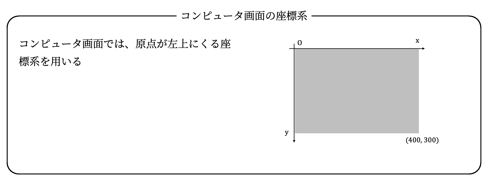
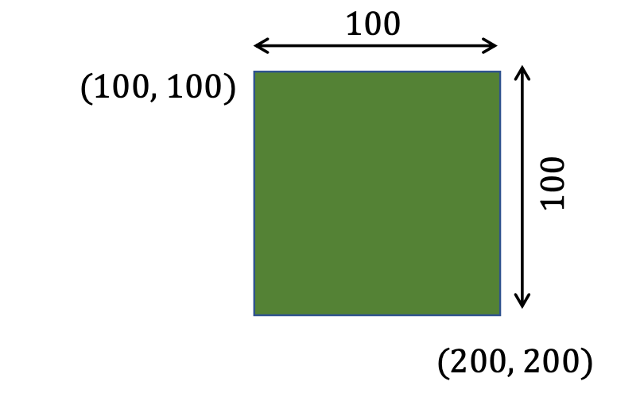
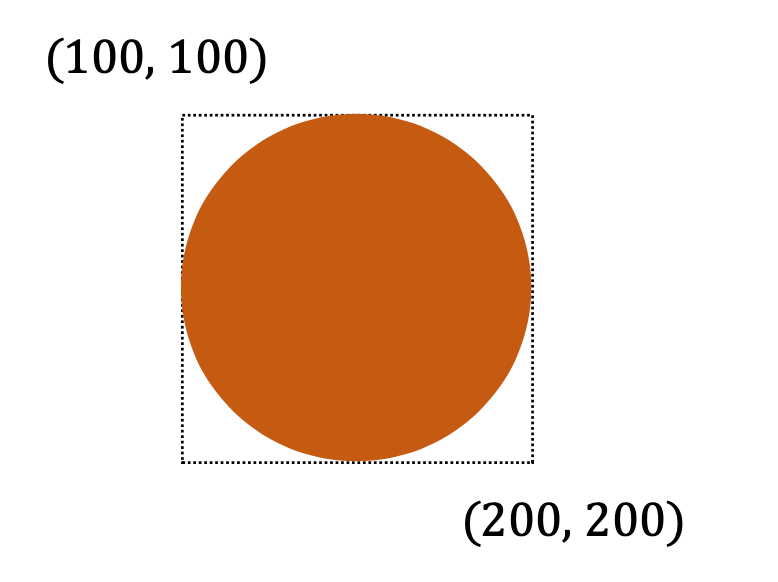
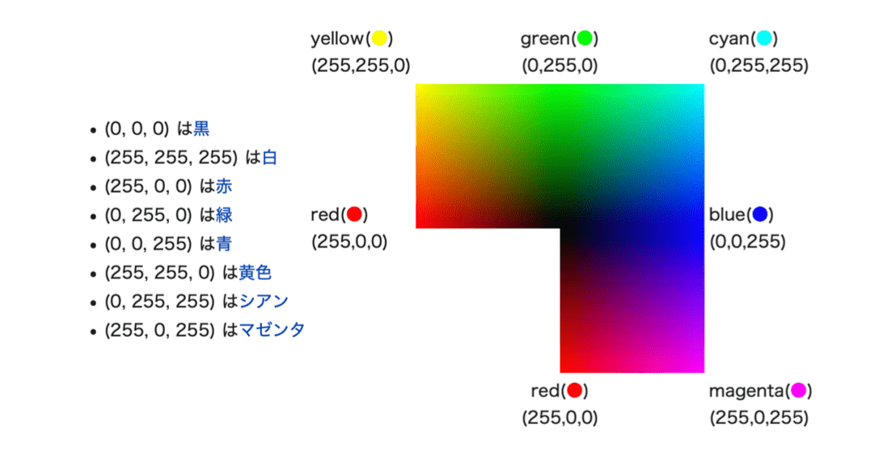
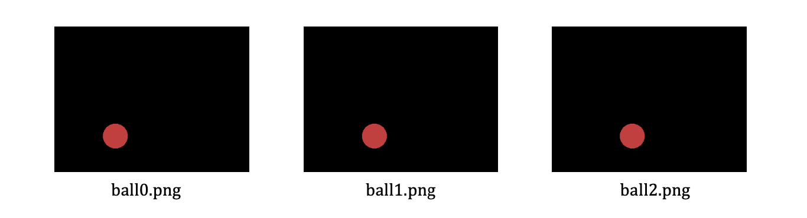

# プログラミングを思い出そう

夏休みで忘れてしまったかもしれないプログラミングを思い出していきましょう。

## 入社面談より

昔の倉光研の学生がGoogle社の入社面談を受けたとき、ホワイトボードの前で「ちょっと書いてみて」と聞かれた設問のひとつです。

<div class="admonition tip">

**例題(Google関数)**

与えられた整数xを反転させる関数`g(x)`を定義してみてください。

`g(x)`の例: 

* `g(12)`ならば`21`、
* `g(1234)`ならば`4321`
* `g(90)`ならば`9`

</div>

<div class="admonition note">

Let's try: ホワートボードコーディング

面接でプログラミング力を試させること

ただ、プログラミングを書くだけでなく、エレガントなコーディングやセンスも問われます。


解答例を見る前に少し書いてみましょう。
（この間、倉光は就職活動に関する雑談をします。）

</div>


### 解答例（１）

過去、Google関数をプログラミング課題として出題してみると、驚いてしまうことに、ほとんどの学生が以下のような解答を提出してきました。

```py
def g(x):
    if x == 12: return 21
    if x = 1234: return 4321
    return 9

```

たぶん、この解答で採用してくれる企業は、ありません。(プログラミング力以外のものを期待しているのでしょうね。)

### 解答例（２）

前期のPython プログラミングを履修してきた皆さんなら、文字列に変換して反転かと思います。

```py

def g(x):
    return int(str(x)[::-1])

```

正直、好き嫌いが分かれる解答です。（文字列に変換するなんてずるいと感じる人もいます。）

### 解答例（３）

昔、すごく頭のよい学生がいて、ループであっさりと書いてくれたことがあります。

```py
def g(x):
    inv = 0
    while x!= 0:
        inv = inv * 10 + x % 10
        x //= 10
    return inv

```

頭が良すぎて、ソースコードを読んだだけでは、正しいのかわかりません。

<div class="admonition note">

**ホワイトボード・コーディング**

面接でプログラミング力を試させること

ただ、プログラミングを書くだけでなく、エレガントなコーディングやセンスも問われる。

</div>

### 解答例（４）：再帰派

僕は**再帰派**なので、入社面接で聞かれたら、
意地でも再帰で答えておくでしょう。

```py
import math

def g(x):
    if x < 10:
        return x
    scale = 10 ** int(math.log10(x))
    return (x % 10) * scale + g(x//10)

```

# PNGアニメーション

今回は、モジュールの使い方を学びながら、
PNGアニメーションの作成方法を学びましょう。
あと、Python（前期の授業）も思い出していきましょう。

## モジュールの準備

Pythonは、最低限の言語機能のみ提供し、
便利な拡張機能は**モジュール**(Pythonのライブラリのこと)で提供しています。

__Pillow(PIL)モジュール__: Pythonで画像を簡単に扱う

```py
from PIL import Image, ImageDraw
```

__APNGモジュール__: アニメーションPNGを作成する

Colabは、あらかじめ多くのモジュールがインストールされた状態ですが、
APNGはインストールされていません。
そのようなモジュールは、`pip install`を使って、
先に追加インストールしておきます。

```py
!pip install APNG
from apng import APNG

```

__IPythonモジュール__: 画像/動画をColab上に表示する

```py
import IPython
```

<div class="admonition note">

Python のモジュールを追加インストールする便利なコマンド\\

Colab上では、他のUNIXコマンドと同様に`!`マークをつけて記述します。

```
pip install ＜モジュール名＞
```
</div>

これらのモジュールは、ノートブックの先頭でまとめてインポートしておくと良いでしょう。

__まとめてインポートする__

```py
from PIL import Image, ImageDraw
!pip install APNG
from apng import APNG
import IPython
```

## キャンバス

画像を描画するキャンバス(canvas)を作ってお絵かきを始めます。


__大きさを指定して、キャンバスを作成する__

```py
canvas = Image.new("RGB", (400,300))

```

* キャンバスの大きさは、動画にすることを考えて、あまり大きくせず、400 x 300 くらいにしておきましょう。

<div class="admonition note">

コンピュータ画面の座標系



</div>

### 図形を描画する

実際の描画操作は、**描画コンテキスト(draw)**を作って行います。
（この辺りの仕組みは、Python以外のプログラミング言語でもほぼ同じです。）

__キャンバスの描画コンテキストを作る__

```py
draw = ImageDraw.Draw(canvas)
```

まずは、**長方形**{rectangle}をキャンバス上に描画してみましょう。`fill`では、**塗りつぶす色**を指定してます。

__長方形を描画する__

```py
draw.rectangle((100,100,200,200), fill='green')
```



### 画像ファイルの生成

キャンバスに描画した図形をファイル名を指定して、
画像ファイルに保存してみましょう。

__`rect.png`というファイル名で保存する__

```py
canvas.save('rect.png')
```

__保存されたファイルを表示する__

```py
IPython.display.Image("rect.png")
```

以上をまとめて、一度に実行しても構いません。

__四角形を描画してみる__

```py
canvas = Image.new("RGB", (400,300))
draw = ImageDraw.Draw(canvas)
draw.rectangle((100,100,200,200), fill='green')
canvas.save('rect.png')
IPython.display.Image("rect.png")

```

<div class="admonition note">

Let's try (写経するだけでは身につきません)

長方形の色や位置、大きさを変えて表示してみよう

Colab上で、色々、パラメータや条件を変更して試してみましょう。

* 色をピンク色にしてみよう
* 四角形をキャンバスの真ん中においてみよう

</div>

### 円も描画する

PIL/Pillowでは、長方形以外も様々な図形を描画できます。

ecllipseは、指定した短形におさまる楕円（円）を描画します。今回は、色をRGBで指定してみましょう。

```py
draw.ellipse((100,　100, 200, 200),fill=(192, 64, 64))
```



<div class="admonition note">

RGB

三原色の組み合わせからコンピュータ上の色を指定する方法



</div>

同じキャンバスの上に図形を追加すれば、複数の図形を描画できます。

__四角形と円を描画してみる__

```py
canvas = Image.new("RGB", (400,300))
draw = ImageDraw.Draw(canvas)

draw.rectangle((100,100,200,200), fill='green')
draw.ellipse((250,200, 300, 250),fill=(192, 64, 64))

canvas.save('canvas.png')
IPython.display.Image("canvas.png")
```


### (チャレンジ課題) キャンバスになれる

ここまで無事にできたら、
キャンバス(Pillow)に長方形や円形以外にどのような図形が描画できるか調べてみましょう。

* 多角形
* 線分
* 文字(text,font)
* 他の画像ファイル

<div class="admonition note">

Pillowの情報源

以下のサイトを参考にするとわかりやすいです。

* https://note.nkmk.me/python-pillow-imagedraw/}

</div>

## アニメーションを作る

動画は、パラパラ漫画と同じ原理で作ります。
つまり、複数の画像ファイルを作成し、APNGモジュールで合成してみます。

### 複数枚の画像を作る

まず、ボールが転がるアニメーションを作ってみましょう。

x軸方向に `+20`ずつ移動させながら、３枚ほど画像を作ります。

__ball0.pngを作る__

```py
canvas = Image.new("RGB", (400,300), color='black')
draw = ImageDraw.Draw(canvas)
draw.ellipse((100, 200, 150, 250),fill=(192, 64, 64))
canvas.save('ball0.png')
IPython.display.Image("ball0.png")
```

__ball1.pngを作る__

```py
canvas = Image.new("RGB", (400,300), color='black')
draw = ImageDraw.Draw(canvas)
draw.ellipse((100+20, 200, 150+20, 250),fill=(192, 64, 64))
canvas.save('ball1.png')
IPython.display.Image("ball1.png")
```

__ball2.pngを作る__

```py
canvas = Image.new("RGB", (400,300), color='black')
draw = ImageDraw.Draw(canvas)
draw.ellipse((100+40, 200, 150+40, 250),fill=(192, 64, 64))
canvas.save('ball2.png')
IPython.display.Image("ball2.png")
```



こんなの一枚ずつ画像を作っていてはいけませんよね。

<div class="admonition note">

Let's try

for文を覚えている人は、3枚以上作成してみてください。

</div>

### APNGに変換する

Pillowで保存したPNG画像のファイル名をリストに入れます。

```py
filelist = ['ball0.png', 'ball1.png', 'ball2.png']
```

APNG モジュールは、画像ファイルのリストからアニメーションPNGを作成します。

delay は、画像1枚辺りのめくる速度(ミリ秒)です。

```py
APNG.from_files(filelist, delay=100).save("ball-anime.png")
IPython.display.Image("ball-anime.png")
```

<div class="admonition note">

Let's try

実際にアニメーション(APNG)を作成して表示してみよう。
(大したアニメでないのであまり期待しないでください)

</div>

### ボールを投げるアニメメーション

<div class="admonition tips">
(例題) 放物線

ボールがいい感じで放物運動するアニメーションを作ってみましょう。

</div>

時刻$t$のときの(x,y)を次のようにします。
（ここのパラメータは自由に調整して構いません。）

```math
x = 10t + 100 \\ y = (t-10)^2 + 100
```

あとは、時刻tを`for t in range(20):` のようにループを使って進め、順次PNG画像を作ります。そのとき、同時にPNG画像の名前を `filelist` に追加しておきます。

__放物線のアニメーション__

```py
filelist = []

for t in range(20):
    canvas = Image.new("RGB", (400,300), color='black')
    draw = ImageDraw.Draw(canvas)
    x = 10 * t + 100
    y = (t -10)**2 + 100
    draw.ellipse((x, y, x+50, y+50),fill=(192, 64, 64))
    canvas.save(f'ball{t}.png')
    filelist.append(f"ball{t}.png") #ファイルリスト

APNG.from_files(filelist, delay=100).save("ball-anime.png")
IPython.display.Image("ball-anime.png")
```

##　コースワーク

<div class="admonition tip">

（演習問題）円形運動

チャレンジ課題として、キャンバスの中心をぐるぐるとまわる物体のアニメーションを作成してみましょう。

</div>


