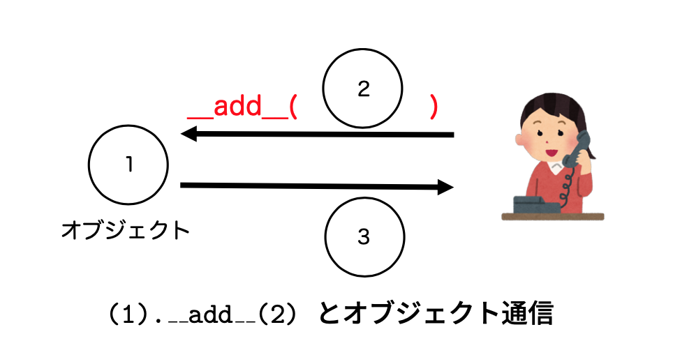
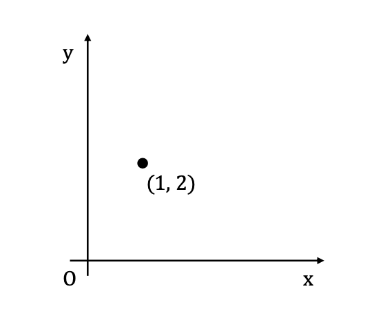
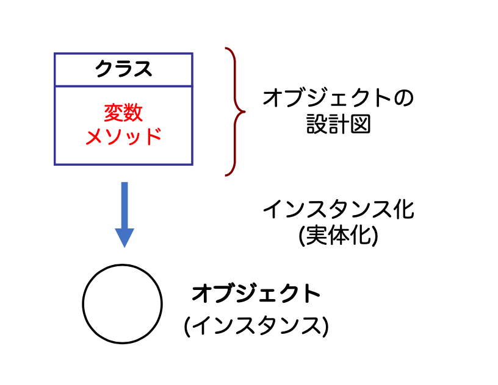
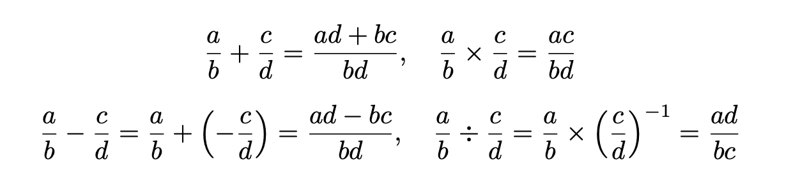

# クラスとメソッド定義

オブジェクト指向プログラミング(object-oriented programming)とは、1960年代の**ソフトウェア危機** のあと、複雑なプログラム（つまり、ソフトウェア）を効率高く開発するために考案されたプログラミング手法です。

現在のソフトウェア開発におけるスタンダードなプログラミング手法になっています。オブジェクト指向を理解しなければ、プログラミングできないだけでなく、コードも読むことも難しくなります。

まずは、基本的な考え方を抑えておきましょう。

## 基本な考え方

オブジェクト指向プログラミングを理解するための基本的な概念は次のようなものがあります。

- 全ては**オブジェクト(object)**
- **メッセージング**: プログラムは、オブジェクト間の **メッセージ通信 (messaging)** とみなす
- カプセル化: **クラス(class)** でオブジェクトを設計し、外から見える必要がないものはみえなくする
- **クラス継承（抽象化）**: プログラムの共通部分に焦点をあて、クラスを設計する



## データ構造

オブジェクト指向言語は、歴史的にはSimula3の[抽象データ型(ADT)](https://ja.wikipedia.org/wiki/抽象データ型)から発展してきたとされます。
同じく、データ型からオブジェクト指向を理解していきましょう。

Python は、今まで学んだきた通り、便利なデータ型を提供してくれます。

* __論理値(bool)__: `True`, `False` 
* __整数(int)__: `123`
* __浮動少数点数(float)__: `1.23`
* __文字列(str)__: `"123"`
* __リスト(list)__: `[1, 2, 3]`
* __タプル(tuple)__: `(1, 2, 3)`

ところが、世の中のデータは、これらのデータ型だけでは十分ではありません。

### xy 平面上の点

xy 平面上の点P(1,2)を表現する方法を考えてみましょう。




点Pの x座標, y座標はそれぞれ数値で表現できます。しかし、数値で点を表現すると、ひとつの点につき、`px`, `py` のように２つの変数が必要になります。


```py
px = 1 
py = 2 
qx = 2 
qy = 3

print(f'P座標 ({px}, {py})') 
print(f'Q座標 ({qx}, {qy})')

```

もしプログラム内で扱う点の数が増えたら、点を扱うのが難しくなります。xy平面上の点として、x座標とy座標の値を、1つのデータ構造として、**ひとまとまり**で扱いたくありませんか？

<div class="admonition note">

データ構造

複数の値からなるデータをひとつの変数から扱えるようにすること

</div>

### タプル

Python は、既に学んできたとおり、リストやタプルなどの複数の値をまとめて扱うデータ構造があります。

タプルを使ってみると：

```py
p = (1, 2) 
q = (2, 3)

print(f'P座標 ({p[0]}, {p[1]})') 
print(f'Q座標 ({q[0]}, {q[1]})')
```

x座標とy座標をひとまとまりのデータとして扱えるようになります。
しかし、タプルを用いて、平面上の点を記述すると新たな問題も発生します。

__問題1__: 直感的に、x,y 座標の値を理解しにくい。
次は、点Pと点Qの距離を計算する式ですが ...

```
sqrt((p[0]-q[0])**2 + (p[1]-q[1])**2))
```

__問題2__: 演算子の意味が異なる。
もし、点Pと点Qを加算してみたら、期待通りの結果が得られますか？

```
p + q
```

やはり、平面上の点を表現するための、**より目的に特化したデータ構造**があるといいと思いませんか?

<div class="admonition note">

**オブジェクト指向**

目的にあったデータ構造を定義するクラス機能を提供する

</div>

## クラスとオブジェクト

クラス(class)は、データ構造を設計するプログラミング機能です。

まずは、先ほどの平面上の点 `(x,y)` を表す `Point` クラスを作ってみましょう。

__xy平面上の点__ `Point`クラス

```py
class Point(object):
    x: number
    y: number
    def __init__(self, x, y):
        self.x = x
        self.y = y
```

Pointクラス上で定義された変数`x`と`y`のことをプロパティ（Java: フィールド, C++: メンバ変数)と呼びます。平面上の点(x,y)に相当します。

`__init__`は、**コンストラクタ**と呼ばれる特殊な関数です。新しいデータを生成するときに、初期化するために使われます。`self`は、自己参照変数と呼ばれる特殊な変数で、データの自分自身を表します。

### インスタンス化

クラスは設計図です。実体のあるデータではありません。オブジェクト指向言語では、クラスから作られたデータのことを、**オブジェクト(object)**、もしくは**インスタンス(instance)**と呼びます。



__クラスのインスタンス化__

```py
p = Point(1, 2)
```

`Point`はクラス名ですが、関数のように呼び出すことができます。このとき、`Point`クラス内で定義されたコンストラクタ`__init__(self, x, y)`が呼び出され、与えられた引数の値をプロパティに持つオブジェクト`p`が生成されます。

オブジェクトのプロパティは、`p.x`のように参照して、値をえます。

__p.x (pのxプロパティ)__

```py
print(p.x)
```

__p.y (pのyプロパティ)__

```py
print(p.y)
```

<div class="admonition note">

Let's try

P(1,2)とQ(2,3)をインスタンス化して、そのx,y座標を表示してみよう

</div>

```py
p = Point(1, 2)
q = Point(2, 3)

print(f'P座標 ({p.x}, {p.y})')
print(f'Q座標 ({q.x}, {q.y})')
```

### インスタンスかどうか

オブジェクト指向プログラミングを始めると、いろいろな種類のオブジェクトが登場します。あるオブジェクトが何のクラスか知りたいことも多くなります。

`isinstance(x, c)`は、`x` が クラス `c` のインスタンスであるか判定する関数です。

__pは、Pointクラスのインスタンスかどうか？__

```py
isinstance(p,Point)
```

__(1,2)は、Pointクラスのインスタンスかどうか？__
```py
isinstance((1,2), Point)
```

<div class="admonition note">

Let's try: クラス名を調べる

Pythonは、すべてがオブジェクトです。整数値`0`も文字列も全て何かしらのクラスのオブジェクトになっています。xのクラス名は、`type(x)`関数で調べることができます。

整数値 `1`のクラス名を調べる

```
type(1)
```

</div>

### 点P,Qの中間点を求める

Pointクラスに戻って、少し例題で練習しておきましょう。

<div class="admonition tip">

**例題（中間点を求める）**

任意の２点P, Qの中間点を求める関数 mid(p, q)を定義してみよう。

__例__

```
p = Point(1, 1)
q = Point(3, 3)

m = mid(p, q)

print(f'中間点 ({m.x}, {m.y})')
```

ポイントは、関数 mid(p, q)の結果も、Point オブジェクトになる点です。

</div>


関数 mid(p,q) は、中間座標を計算したあと、新しく Point クラスをインスタンス化して、
Point オブジェクトとして結果を返します。

```py
def mid(p, q):
    mx = (p.x + q.x) // 2
    my = (p.y + q.y) // 2 
    return Point(mx, my)

p = Point(1, 1)
q = Point(3, 3)
m = mid(p, q)

print(f'中間点 ({m.x}, {m.y})')

```

<div class="admonition note">

Let's try

任意の２点間の距離を求める関数distance(p,q)を定義してみよう。

```py
def distance(p, q):
    return # 自分で完成させよう
```

</div>


## クラスとメソッド

メソッドは、クラス上に定義された**オブジェクトに対する操作**を記述する関数です。メソッドを定義すると、オブジェクトがますます便利に使えるようになります。

<div class="admonition note">

メソッドを定義すると

`mid(p,q)` の代わりに、`p.mid(q)` のように書ける

</div>

__メソッドの定義方法__

* クラス定義 (class) 内で定義する
* 操作の対象となるオブジェクトは自分自身 (self) になる 

まずは、先ほどの mid(p,q) 関数をメソッドとして定義してみます。

__関数定義のメソッド化__

* 関数定義をクラス内のブロックに移動させる
* 全体的をインデントを下げる
* 関数の第一引数 を **self に変更する**

```py
class Point(object):
    x: int # 省略してもよい 
    y: int # 省略してもよい
    
    def __init__(self, x, y): 
        self.x = x
        self.y = y
    
    def mid(self, q): # 先 ほ ど のmid(p,q)のメソッド化 
        mx = (self.x + q.x) // 2
        my = (self.y + q.y) // 2 
        return Point(mx, my)
```

プロパティの値は、`p.x`のようにオブジェクトの変数`p`から参照します。しかし、メソッド定義からみると、自分自身に何の変数名が与えられているかわかりません。そこで、自己参照変数 `self`を用います。

<div class="admonition note">

Let's try

点P(1,1),Q(3,3)の中間点をメソッドを用いて、求めてみよう。

</div>

```py
p = Point(1, 1) 
q = Point(3, 3)
m = p.mid(q)

print(f'中間点 ({m.x}, {m.y})')
```

クラス定義を始めると、**自己参照変数(self)** の意味が最も理解しにくいところです。多くの学生が何度か書いたら、「突然わかる」ようになるといいます。
Colabは、Pythonを試してみるのに優れた環境なので、何度かメソッドを書いてみてください。

<div class="admonition note">

Let's try

任意の２点間の距離を求める関数distance(p,q)もメソッドとして定義してみよう。

```py
    def distance(self, q):
        return # 自分で完成させよう
```

</div>

### オブジェクトの表示 `__repr__`

Python では、`__repr__(self)` というメソッド名は、オブジェクトの内部を文字列として表示のための**特別なメソッド名**になっています。

`__repr__(self)`の定義前: オブジェクトの内部は見えない

```py
Point(1, 2)
```

`__repr__(self)`を定義する

```py
class Point(object):
    x: int 
    y: int 
    def __init__(self, x, y):
        self.x = x
        self.y = y
    
    def __repr__(self):
        return f'({self.x}, {self.y})'
```

`__repr__(self)`の定義後

```py
Point(1, 2)
```

<div class="admonition important">

クラスを定義したら:  `__repr__(self)` を定義しておくと、オブジェクトの内容が見えるので、開発がしやすくなります。

</div>

## 空間上の点

ここまでの練習として、空間上の点を表現するクラスを定義してみましょう。

<div class="admonition tip">

**例題（空間上の点）**

空間上の点 (x, y, z) を表現するクラスPoint3Dを定義せよ。また、空間上の2点間の中間点 (mid) と距離 (distance) を求めるメソッドも定義せよ。

__例__

```
p = Point3D(1.0, 2.0, 3,0)
q = Point3D(4.0, 4.0, 4.0)

print('点P', p)
print('点q', q)
print('中間点', p.mid(q))
print('距離', p.distance(q))
```

</div>


```py
import math
class Point3D(object): 
    x: float
    y: float
    z: float
    def __init__(self, x, y, z):
        self.x = x
        self.y = y
        self.z = z
    
    def __repr__(self):
        return f'({self.x},{self.y},{self.z})'

    def mid(self):
        return f"({self.x}, {self.y}, {self.z})" def mid(self, q):
        x = (self.x + q.x) / 2 
        y = (self.y + q.y) / 2
        z = (self.z + q.z) / 2 
        return Point3D(x, y, z)

    def distance(self, q): 
        dx = self.x - q.x
        dy = self.y - q.y
        dz = self.z - q.z
        return math.sqrt(dx**2 + dy**2 + dz**2)
```

### 研究: 動的束縛

クラス Point と Point3D を比較したとき、注目したいところはメソッド名です。

クラスが違えば、同じメソッド名を定義することができます。しかもクラスごとに異なる処理を行うことができます。

さらに、注目して欲しいのは、2次元版も3次元版も全く同じコード `p.distance(q)` で距離を計算できています。

__Pointの場合__
```py
p = Point(1,2)
q = Point(2,3)
print(p.distance(q))
```

__Point3Dの場合__
```py
p = Point(1,2,3)
q = Point(2,3,4)
print(p.distance(q))
```

オブジェクト指向プログラミングの大きな特徴に**動的束縛 (dynamic binding)** という機構がありま す。これは、実行時に、クラスの種類によって呼び出すメソッドを決定してくれるものです。つまり、pが`Point`クラスなら、`Point`クラスのメソッド、pが`Point3D`クラスなら、`Point3D`クラスのメソッドが呼び出されます。

<div class="admonition important">

動的束縛は、if 文などの条件分岐と等価な役割を果たしています。もし、動的束縛を使わないと、次のようにpのクラスごとに処理を切り替えるように書くことになります。

```py
import math

def distance(p, q):
    if isinstance(p, Point):
        dx = p.x - q.x
        dy = p.y - q.y
        return math.sqrt(dx ** 2 + dy ** 2) 
    
    if isinstance(p, Point3):
        dx = p.x - q.x 
        dy = p.y - q.y
        dz = p.z - q.z
        return math.sqrt(dx ** 2 + dy ** 2 + dz ** 2)
```
</div>

動的束縛を活かしたプログラミングは、次回、**ポリモーフィズム** としてさらに詳しく取り上げます。

## コースワーク

[有理数](https://ja.wikipedia.org/wiki/有理数)とは、２つの整数 $a$, $b$ (ただし $b$ は $0$ でない)をもちいて、

```math
\frac{a}{b}
```

という分数で表せる数です。 $b = 1$ とすることにより、任意の整数は有理数となります。

<div class="admonition tip">

**コースワーク（有理数）**

有理数をクラスで定義してみよう。

1. 有理数クラスを定義する (クラス名は、`Q`、プロパティは`a`と`b`を用いるとよい。)
2. クラス`Q`をインスタンス化し表示できるようにする。例えば、`Q(1,2)`は、`1/2`と表示される. `Q(2,1)`は、`2`となる。
3. 約分も忘れずに: `Q(2,4)`は、`1/2`となる。
4. 整数も表せるようにする. 任意の整数x に対し、`Q(x,1)`は`x`となる。
5. 加算(add)できるようにする。つまり、`Q(1, 2).add(Q(1, 3))`は、`5/6`になる
6. 四則演算を全部、実装する




7. (上級者向け）次週の演算子オーバーロードを予習し、`Q(1,2) + Q(1,3)`のように加算できるようにする。

</div>


