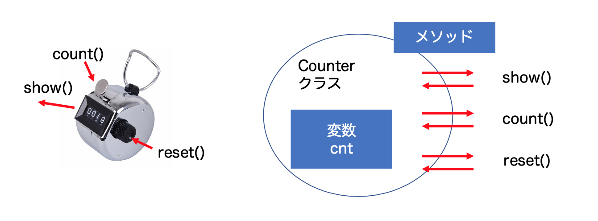
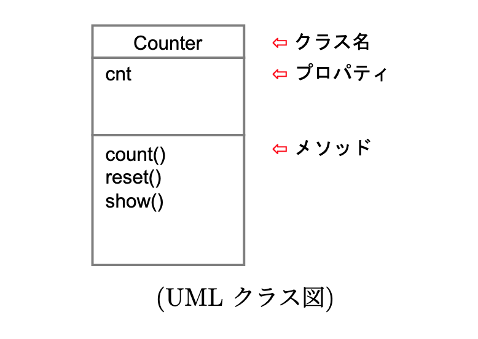
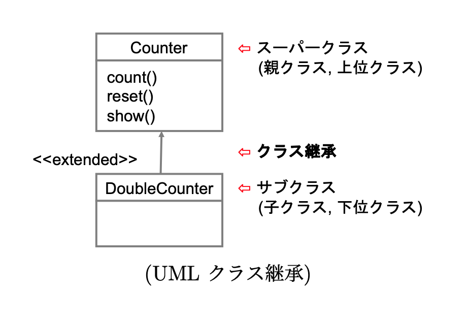

# クラスと継承

## オブジェクト指向設計法 

オブジェクト指向設計法とは、オブジェクト(事物)の性質を考え、__抽象化(abstraction)__ しながら、クラスを設計することです。

* オブジェクトは、どのような状態があるか？
* オブジェクト間にはどのようなメッセージのやりとりがあるか？

<div class="admonition note">

**抽象化**

不要な情報を捨てて、より本質のみ焦点を当てること

</div>

ここでは、カウンターを例に考えます。カウンターをイメージしてください。


Q. カウンターの内部には、どのような情報がありますか? 

> これは、プロパティの設計になる   

Q. カウンターとは、どのような情報のやりとりがありますか? 

> これは、メソッドの設計になる



<div class="admonition note">
インターフェース

オブジェクトと外部間で情報をやりとりをするメソッドのこと（ソフトウェアの設計でもっとも重要な概念となる）
</div>

### UMLクラス図

クラス設計は、どのオブジェクト指向プログラミングであっても、基本的に共通です。プログラミングに依存せず、クラス設計を図示する手法として、[UMLクラス図](https://ja.wikipedia.org/wiki/統一モデリング言語)があります。




大規模なソフトウェア開発では、まず UMLクラス図を用いてクラス設計だけ先に行います。もちろん、UMLクラス図を用いず、Python などのプログラミング言語で直接、ソースコードで設計することもあります。

UMLクラス図の設計に基づいて、Pythonクラスを定義していきましょう。

__クラス設計: まず、インターフェースだけ定義します。__

```py
class Counter(object):
    cnt : int
    def __init__(self):
        pass

    def count(self):
        pass

    def reset(self):
        pass

    def show(self):
        pass

```

<div class="admonition warning">

**設計と実装**

クラスを設計するときは、先にインターフェースだけ定義し、メソッドの本体は`pass`などにしておきます。インタフェースの設計が終わったら、`pass`の部分を実装していきます。

</div>

オブジェクト指向プログラミングでは、クラス設計が重要になります。クラス設計がしっかりしていれば、各メソッドの実装は意外と簡単です。大規模なソフトウェア開発では、クラス設計とメソッド開発は分業して行うことも少なくありません。

<div class="admonition note">

Let's try

クラス設計にしたがって、各メソッドを実装してみよう。（つまり、`pass`の部分を意味のあるコードに書き直す。)

</div>


__クラスの実装__

```py
class Counter(object):
    cnt : int
    def __init__(self):
        self.cnt = 0

    def count(self):
        self.cnt += 1

    def reset(self):
        self.cnt = 0

    def show(self):
        print(self.cnt)

```

### カウンタ

インスタンス化の練習を兼ねて、オブジェクト指向プログラミングを練習しておきましょう。

<div class="admonition tip">

**(例題)カウンタ**

関数`stat(a, c)`は、カウンタ`c`を用いて、数列`a`の5の倍数を数える。ただし、数列中に9の倍数が出現したときは、カウンタはリセットされるものとする。

```py
def stat(a: list, c: Counter):
    # 自分で考えよう
```
</div>

大して難しくないはずなので、答えを書いておきます。

```py
def stat(a: list, c: Counter):
    for x in a:
        if x % 5 == 0:
            c.count()
        if x % 9 == 0:
            c.reset()

c = Counter()
stat(range(1, 100), c)
c.show()

```

<div class="admonition note">

**考えてみよう**

関数`stat(a,c)`を一切修正することなく、9の倍数でもリセットされないようにするにはどうしたらいいだろうか？(できるのだろうか？)
</div>

## クラス継承

__クラス継承(class inheritance)__ は、オブジェクト指向プログラミングの効率を向上させる手段です。
難解的には難しいところがありますが、まずはシンプルに理解しておきましょう。

<div class="admonition note">
(操作的意味論による解釈)クラス継承  

新しいクラスを定義するとき、既存のクラスから拡張すること
</div>

クラス継承を用いると、`Counter`クラスから、2重に数える`DoubleCounter`クラスをクラス継承で作ることができます。




<div class="admonition note">

__用語__

オブジェクト指向言語では、継承元のクラスのことを __スーパークラス(super class)__ 、もしくは __親クラス (parent class)__ 、継承されたクラスのことを __サブクラス(sub class)__ 、もしくは __子クラス(child class)__ と呼びます。

</div>

### クラス定義の例

これも具体例を考えながらみていきましょう。

ここでは、1回の`count()` 操作で、2回カウントす
る `DoubleCounter` クラスを考えます。

__Counterクラスから継承__

```py
class DoubleCounter(Counter):
```

`DoubleCounter` は、`Counter`クラスのサブクラスになります。サブクラスになると：

* スーパークラスのプロパティとメソッドを __そのまま使うことができる__
* 新しくプロパティやメソッドを追加することができる
* スーパークラスのメソッドを __異なる処理をするように書き換えることができる__
* ただし、スーパークラスのプロパティとメソッドを取り除くことはできない

__DoubleCounterクラスの定義__

```py
class DoubleCounter(Counter):
    def count(self):
        self.cnt += 2
```

<div class="admonition warning">

**クラス継承されるので：**

`count()`メソッドだけ定義しなおせば良い。

他のメソッドやプロパティは `Counter` クラスの定義をそのまま使うことができます。

</div>

実際に試してみると：

```py
c = DoubleCounter() 
c.count()
c.show() # 2と表示される。
```

このように、オブジェクト指向プログラミングでは、クラス継承を活用することで、既存のクラスを再利用して 効率よくクラスを定義できるようになります。

<div class="admonition note">

**Let's try**

`Counter`クラスを継承して、次のカウンタを作ってみよう。

* `ZeroCounter`: `count()`操作しても、カウントされない
* `SecureCounter`: `reset()`操作しても、リセットされない

</div>

### ポリモーフィズム (多相性)

クラス継承には、ポリモーフィズム(多相性)という優れた効果があります。


<div class="admonition note">

Let's try

関数`stat(a, c)`を一切変更することなく、9の倍数が出現したとき、リセットすることなく、5の倍数の数を数えてみよう。

```py
def stat(a: list, c: Counter):
    for x in a:
        if x % 5 == 0:
            c.count()
        if x % 9 == 0:
            c.reset()
```

</div>

ヒント: `reset()`を無効にしたカウンタを作ります。

__失敗する例: reset()のないカウンタ__

```py
class NonResetCounter(object):
    cnt : int
    def __init__(self):
        self.cnt = 0

    def count(self):
        self.cnt += 1

    def show(self):
        print(self.cnt)

```

__動かしてみると__

```py
c = NonResetCounter()
stat(range(1, 100), c)
c.show()
```

次のようにエラー(AttributeError)が発生します。これは、`NonResetCounter`に`reset()`がないからです。

> AttributeError: 'NonResetCounter' object has no attribute 'reset'

つまり、`NoResetCounter`クラスは、一見、`Counter`クラスのように見えますが、`reset()`がないため、`Counter`クラスとして役割が果たせません。

<div class="admonition note">
型エラー

オブジェクトの種類が異なることによって発生するエラー

</div>

一方、次のように、`Counter`クラスを継承し、`reset()`で何もしないように定義すると：

__成功する例: SecureCounterクラス__

```py
class SecureCounter(Counter):
    def reset(self):
        pass

```

```py
c = SecureCounter()
stat(range(1, 100), c)
c.show()
```

これは、`SecureCounter`クラスは、`Counter`クラスの機能を全て継承しているため、常に`Counter`としての役割を果たせることが保証されます。

つまり、継承された`SecureCounter`オブジェクトは、常に`Counter`オブジェクトの代わりに用いても __型エラーにならないことを保証されます。__ このような性質を __型安全性__ と呼びます。


<div class="admonition note">
型安全性

型エラー (type error) が発生しないことが保証される

</div>

クラス継承は、型安全で、`Counter`, `DoubleCounter`, `SecureCounter`のように、様々なプログラム実行の振る舞いを変更することができます。__ポリモーフィズム__ は、オブジェクトが、同じインターフェースで、様々な振る舞いを実現する性質です。

## コースワーク

<div class="">

```py

class Expr(object):
    def eval(self):
        return None

class Val(Expr):
    value: float
    def __init__(self, value):
        self.value = float(value)
    def eval(self):
        return self.value

class BinaryExpr(Expr):
    left: Expr
    right: Expr
    def __init__(self, left, right):
        self.left = left
        self.right = right

class AddExpr(BinaryExpr):
    def eval(self):
        return self.left.eval() + self.right.eval()

class MulExpr(BinaryExpr):
    def eval(self):
        return self.left.eval() * self.right.eval()


```