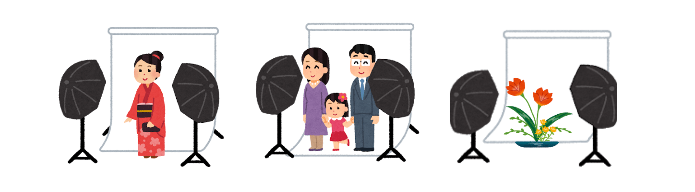
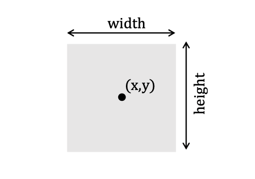
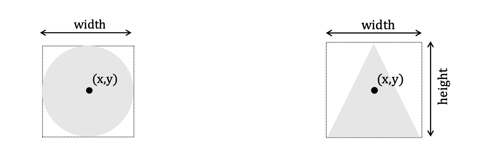
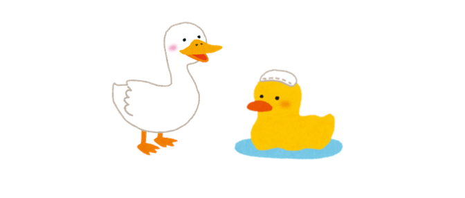

# PNG アニメーション

クラス継承も含めたオブジェクト指向設計手法をみてきたいと思います。
実例として、第１回目に用いたPythonによるPNGアニメーション画像の作成を用います。

よりすっきり見通しよくプログラミングできることを考えてみましょう。

## PNG アニメーション

まず、Pillowを用いてPNGアニメーションを作成するプログラムを考えてみます。（第１階目のコースワークの回答例です。）

__円形運動__

```py
!pip install APNG
import os, IPython
from PIL import Image, ImageDraw, ImageFont
from apng import APNG
from math import cos, pi, sin

files = []
frames = 50
for index in range(frames):
    filename = "file%02d.png" % index
    im = Image.new("RGB", (400, 300), (255, 255, 255))
    draw = ImageDraw.Draw(im)
    x = 100*cos(2*pi*index/frames) + 200
    y = 50*sin(2*pi*index/frames) + 150
    draw.ellipse((x-30, y-30, x+30, y+30), fill='blue')
    draw.text((10,10), repr((x//1,y//1)), "black")
    im.save(filename)
    files.append(filename)

APNG.from_files(files, delay=100).save("animation.png")
IPython.display.Image("animation.png")
```

<div class="admonition note">

ソフトウェア危機

より複雑な動画を作ろうとすると、コードが複雑になっていきます。そのうち、複雑に成り過ぎて **破綻** します。
このような破綻を避けるため、オブジェクト指向プログラミングが生まれました。

</div>

### ACanvas クラス

```py
class ACanvas(object):
    width: int
    height: int
    image: Image
    draw: ImageDraw

    def __init__(self, w=400, h=300, background=(255,255,255)):
        self.width = w
        self.height = h
        self.image = Image.new("RGB", (w, h), background)
        self.draw = ImageDraw.Draw(self.image)

```

## 実世界からモデルを考える

まず、アニメーション作成をモデル化して、クラスとして設計してゆきます。

モデルを考えるときは、実世界、特に身のまわりの事象を参考に考えます。
ここでは、写真館（撮影スタジオ）をモデルにして、クラス設計していきます。

写真館と`AStudio`クラスは、よく似ていると思いませんか？



**写真館**

* 被写体を入れる
* 写真を撮影する
* アルバムに編集して届ける

** AStudioクラス **

* `add()` 被写体(`AObject`)を加える
* `render()` スタジオ内の写真をとる
* `create_png()` 動画を作る

実世界では、被写体は人物であったり、美術品であったり、色々な対象がありえます。
同様にプログラムの世界でも、**様々な対象を撮影できる**ようにしたいです。

このような様々なオブジェクトを扱えるようにする場合は、クラス継承を活用して設計することになります。

`AStudio`クラスの設計

```py
class AStudio(object):
    AObjects: list
    files: list

    def add(self, AObject):
        #被写体(AObject)を追加する
        pass

    def take(self):
        # スタジオ内の写真をとる
        pass

    def create(self, filename):
        # 動画を作る
        pass
```

**被写体(AObject)**

```py
class AObject(object):
    def render(self, canvas):
        #撮影される （未実装）
        pass

```

<div class="admonition note">

抽象クラス

`AAObject`クラスのように、未実装のメソッドが定義されたクラスのことです。

抽象クラスは直接、インスタンス化されず、継承されたサブクラスがインスタンス化されます。

</div>

## AStudio クラスの実装

それでは、クラス設計にしたがって、AStudio クラスを作ってみましょう。

__AStudioクラスの定義__

```py

class AStudio(object):
AObjects: list # 被写体のリスト
files: list # 撮影した写真ファイルのリスト
def __init__(self):
self.AObjects = []
self.files = []

def add(self, AObject):
self.AObjects.append(AObject)

def take(self):
canvas = Image.new('RGB', (400, 300), 'white')
draw = ImageDraw.Draw(canvas)
index = len(self.files)
# 被写体のリストから順番に撮影してゆく
for AObject in self.AObjects:
AObject.taken(draw)
filename = f'frame{index}.png'
canvas.save(filename)
self.files.append(filename)

def create(self, filename='anime.png', delay=100):
APNG.from_files(self.files, delay=delay).save(filename)
for image in self.files:
os.remove(image) # 不要なファイルは消す
self.files = []
return filename
```

## AObject クラスの実装

`AObject` クラスは、被写体を抽象化したクラスです。
`AStudio` クラスの{\tt take()} メソッドから、
順番に {\tt taken(draw)} が呼び出されるようになっています。

```py
class AObject(object):
def taken(self, draw):
#撮影される （未実装）
pass

```

<div class="admonition note">

具体的な撮影内容

`AObject`をクラス継承して`taken(self, draw)`を実装しなおします。

</div>

まず、簡単な例として**長方形**{rectanble}をクラスとして定義してみましょう。

**長方形のプロパティ**

* (中心の)位置(x, y)
* 大きさ(width, height)
* 色(color)


```py
class Rectangle(AObject):
def __init__(self, x, y, width, height, color='black'):
self.x = x
self.y = y
self.width = width
self.height = height
self.color = color

def taken(self, draw):
x, y = self.x, self.y
dx = self.width // 2
dy = self.height // 2
draw.rectangle((x-dx, y-dy, x+dx, y+dx), fill=self.color)
```

あとは、長方形をインスタンス化して、`AStudio` オブジェクトに追加すれば、撮影できるようになります。

```py
studio = AStudio()
red = Rectangle(100, 100, 50, 50, 'red')
green = Rectangle(200, 100, 50, 50, 'green')
studio.add(red)
studio.add(green)

studio.take() # 撮影!!
studio.create()
IPython.display.Image("anime.png")
```

<div class="admonition note">

表示の変更

表示を変更したいときは、`AObject`を継承した新しいクラスを定義することで、`AStudio` クラスを変更せずに行えます。

</div>


\HBold{(例題)} `AObject` クラスを継承して、
円形(Circle)と三角形(Triangle)を表示するクラスを定義してみよう。






## 被写体を動かしてみよう

動画は、スタジオ内の動かしたい被写体のプロパティを更新しながら、連続して撮影することで制作できます。

\begin{center}
\includegraphics[width=0.50\paperwidth]{./figs/studio_movie.pdf}
\end{center}

<div class="admonition note">

表示の変更

表示を変更したいときは、`AObject`を継承した新しいクラスを定義することで、`AStudio` クラスを変更せずに行えます。

</div>

<div class="admonition note">

Let's try

画面を中心にして被写体（何でもいい）をぐるぐると回転させてみよう。

</div>

```py
from math import cos, pi, sin

#スタジオを用意
studio = AStudio()
red = Rectangle(100, 100, 50, 50, 'red')
green = Rectangle(200, 150, 60, 60, 'green')
studio.add(red)
studio.add(green)

frames = 50
for index in range(frames):
x = 100*cos(2*pi*index/frames) + 200
y = 50*sin(2*pi*index/frames) + 150
#物体を移動させる
green.x = x
green.y = y
studio.take() # 撮影

# 動画を編集して表示する
IPython.display.Image(studio.create())
```

## 多重継承

最後に、おまけで前回学んだカウンター(Counterクラス)も表示してしまいましょう。

<div class="admonition note">

(例題)　`AStudio`上でカウント数を表示できる`ACounter`を定義してみよう。

ヒント: カウンターの値は、`draw.text()`を使って表示します。

</div>

２つ以上のクラスから継承することを**多重継承**{multiple inheritance}といいます。
ここは、練習も兼ねて、`Counter`クラスと`AObject`クラスから継承してみます。

```py
from PIL import Image, ImageDraw, ImageFont

#大きめのフォントを用意する
font = ImageFont.truetype('/usr/share/fonts/truetype/humor-sans/Humor-Sans.ttf', 40)

class ACounter(Counter,AObject):
def __init__(self, x, y, color='black'):
# スーパークラスのコンストラクタを呼ぶ
Counter.__init__(self)
self.x = x
self.y = y
self.color = color

def taken(self, draw):
x, y = self.x, self.y
draw.text((x, y), f'{self.cnt}', font=font, fill=self.color)

```

__ACounter の実行__

```py
studio = AStudio()
c3 = ACounter(100, 100, 'red')
c5 = ACounter(200, 100, 'green')
studio.add(c3)
studio.add(c5)

for i in range(50):
if i % 3 == 0:
c3.count()
if i % 5 == 0:
c5.count()
studio.take() # 撮影

IPython.display.Image(studio.create())

見てきた通り、多重継承を使えば、２つの親クラスの性質をかけあわせて、２つの性質をもったクラスを作ることが可能になります。しかし、近年では**禁術扱い**であまり利用は推奨されません。

どちらの親クラスの性質を継承するというのはうまくいくばかりではありません。

### ダックタイピング

Python は、**構造的部分型付け**(structual subtyping, ダックタイピング)です。

`AObject` クラスをわざわぜ継承しなくても、単に{\tt taken()} メソッドだけ追加すれば、何でも撮影できるようになります。

```py
class Counter(object):
cnt : int
def __init__(self, x, y):
self.cnt = 0
self.x = x
self.y = y

def count(self):
self.cnt += 1

def reset(self):
self.cnt = 0

def show(self):
print(self.cnt)

def taken(self, draw):
x = self.x
y = self.y
draw.text((x, y), f'{self.cnt}', fill='black')

```

<div class="admonition note">

ダック・タイピング

「**それがアヒル(duck)にみえるならアヒルとして扱おう**」という考え方です。



</div>

ここでは「**オブジェクトに \tt taken()**メソッドがあるのなら、`AObject`オブジェクトとして撮影してしまおう」と解釈されます。

Python は、ダックタイピングのおかげで、
やばいクラス設計をしてしまっても、
何となくプログラムを実行させることができます。
（ただし、そういうプログラムは、ソフトウェアの信頼性が落ちます。）

## 自由課題(最終課題)

皆さんは、前期の講義ではAOJを使ってPythonを学んできました。

AOJはプログラミングの基礎力をつけるには大変よい自習教材ですが、**デジタル創造性**を高める練習にはなりません。（プログラミングは計算するばかりの道具ではありません。）

それを補うために、次の自由課題に挑戦してみましょう！

<div class="admonition note">

自由課題

（今回までに習ったことを参考にしながら）
お好きな動画を作成して、家族や友人にみせよう。

</div>
