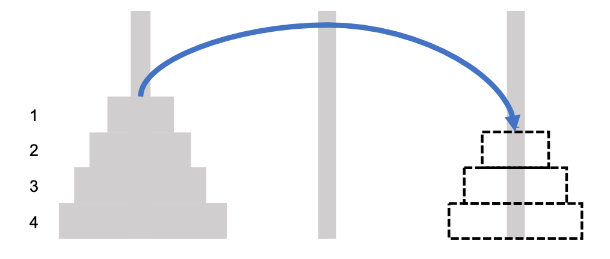
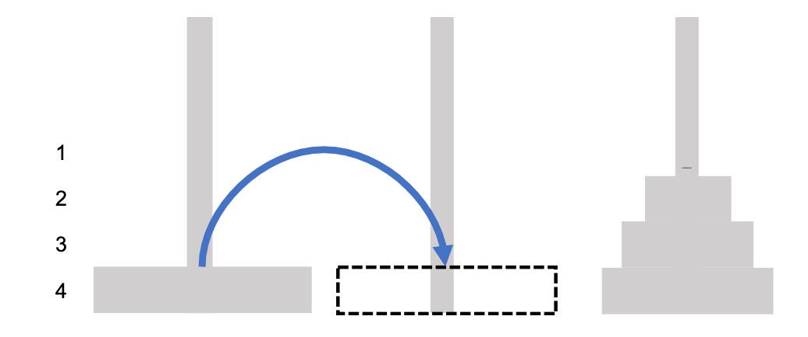
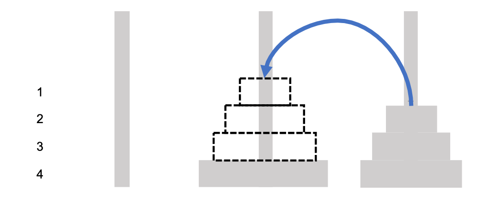

# 再帰アルゴリズム

## 再帰下降構文解析法

まず、文字列で与えられた数式（四則演算）を計算して、
計算結果を出力する関数を書いてみましょう。

<div class="admonition tip">

**例題(数式)**

数式が表現された文字列`s`を受け取り、
計算結果を数値（float）で返す関数`calc(s)`を定義しよう

__関数の実行例__

```
calc("1+2*3")
```

__関数の実行結果__

```
7.0
```

</div>

### 四則演算の式を計算する

いきなり、プログラミングをするのが難しいときは、
シンプルな数式から順番に挑戦していくと良いでしょう。

1. `calc("1")`; 文字列を数値に変換できる
2. `calc("1+2")`: 二項の加算を正しく計算できる
3. `calc("1+2+3")`,`calc("1+2+3+4")`: 二項以上の加算を計算できる
4. `calc("1-2-3")`,`calc("1-2-3-4")`: 二項以上の減算を計算できる
5. `calc("1+2*3")`, `calc("1*2+3")`: 加算と乗算を組み合わせて正しく計算できる

さて、どの辺りまで書けそうでしょうか？

### まず書いてみましょう


### 再帰関数からのアプローチ

さて、数式の構文解析がすんなりと書ける人は意外と少ないものです。
3. までは、すんなり書けても、4. と 5. 辺りで壁にぶつかる人は少なくありません。
この辺りから、**再帰的な考え方**が必要となります。


**1. まず、「魔法の関数$p(s)$が存在する」と仮定する**

$p(s)$は（魔法の関数なので）関数内部をどう実装するかを心配しない。
ただ、$p(s)$は「入力文字列$s$を引数にとり、期待する構文木を正しく返してくれる」ものと信じる。

**2. 次は、魔法の関数$p(s)$の 入力に着目する**

関数内部より文字列の入力を着目して、次の２つの場合にわける。

* **(場合1) 入力文字列$s$には演算子が含まれる **\\

入力 $s=x+y$とすると、
入力文字列は演算子$+$の前後で文字列$x$, $y$に分割する。
そして、ここが重要であるが、分割した文字列$x$,$y$をどう処理するかは考えない。
代わりに、魔法の関数を$p(x)$, $p(y)$にそれぞれ処理してもらうことにする。

\begin{center}
$p(x+y)  ~~~\to~~~$
\synttree{2}[{\tt +}[$p(x)$][$p(y)$]]
% $~~~\to~~~$\synttree{2}[{\tt +}[$x$][$y$]]
\end{center}

* **(場合2) $s$には演算子が含まれない**\\
入力 $s=x$(数字のみ)とすると、$p(x)$は$x$をそのまま返す。
\[
p(x) ~~~\to~~~ x
\]

\end{quote}

<div class="alert alert-info">

復習: \EN{再帰関数{recursive function}

魔法の関数$p(s)$のように自分自身を再度用いて処理を行う関数
</div>

さて、肝心の{\PS}はどこにいったのでしょうか？
実は**$p(s)$こそ{\PS**そのもの}になっています。
確かに`1+2+3`が構文木に変換されていく様子で確かめてみてください。

\begin{center}
$p(\mbox{\fbox{\tt "1+2+3"}})  ~~~\to~~~$
\synttree{2}[{\tt +}[p(\mbox{\fbox{\tt "1+2"}})][p(\mbox{\tt "3"})]]　　$~~~\to~~~$
\synttree{3}[{\tt +}[{\tt +}[p(\mbox{\tt "1"})][p(\mbox{\tt "2"})]][p(\mbox{\tt "3"})]]
$~~~\to~~~$　\synttree{3}[{\tt +}[{\tt +}[\mbox{\tt "1"}][\mbox{\tt "2"}]][\mbox{\tt "3"}]]
\end{center}

構文解析アルゴリズムでは、
**\RD**{recursive descent parsing}と立派な名前がついていますが、
原理的には再帰アルゴリズムと同じになっています。

### 曖昧さと順序

{\RD}は、{\PS}を書くときの基本かつ定番的なアプローチとなっています。
しかし、数式がさらに複雑になると注意すべき点も明らかになってきます。

例えば `"1-2-3"`のような減算式を扱おうとすると、
文字列を分割する順序によって、図\ref{fig:order}に示すように
**出力される構文木の形が変わる**ことに気づくはずです。

\begin{figure}
\begin{center}
**演算子を前から分割する**\\
$p(\mbox{\fbox{\tt "1-2-3"}})$  \\$~~~\Downarrow~~~$\\
\synttree{2}[{\tt -}[p(\mbox{\tt "1"})][p(\mbox{\fbox{\tt "2-3"}})]]　　\\$~~~\Downarrow~~~$\\
\synttree{3}[{\tt -}[p(\mbox{\tt "1"})][{\tt -}[p(\mbox{\tt "2"})][p(\mbox{\tt "3"})]]]
\end{center}
\begin{center}
**演算子を後ろから分割する**\\
$p(\mbox{\fbox{\tt "1-2-3"}}) $ \\$~~~\Downarrow~~~$\\
\synttree{2}[{\tt -}[p(\mbox{\fbox{\tt "1-2"}})][p(\mbox{\tt "3"})]]　　\\$~~~\Downarrow~~~$\\
\synttree{3}[{\tt -}[{\tt -}[p(\mbox{\tt "1"})][p(\mbox{\tt "2"})]][p(\mbox{\tt "3"})]]
\end{center}

\caption{順序と構文木の形}
\label{fig:order}
\end{figure}

{\RD}では**プログラム処理する順序**が重要です。
構文木の構造は、数式を解釈しやすい構造になってないといけませんので、
正しい順序で演算子を処理していかなければなりません。

%一般に、順序が変わると、何通りもの構文木が出力されることを**曖昧である**という。
%自然言語の構文解析では、言語自体の解釈に曖昧さがあるため、
%考えられる全ての構文木を出力する必要がある。
%一方、数式の場合は、構文の解釈が一意に定まっているため、
%曖昧であってはならない。正しい構文木を常に出力する必要がある。

そこで登場するのが、**先読み**{lookahead}です。
先読みは、文字通り、何文字か先に読むことで、処理する順序を正しくする方法です。
今回は、文字列の中から演算子を探し、結合度の低い演算子から文字列を分割していけば、
常に正しい解釈を反映させた構文木が得られるようになります。

### 数式

完成版ではありませんが、加減算の数式{\PS}の実装例(図\ref{fig:p})を示しておきましょう。
ポイントは、文字列の後ろから演算子を先読みすることで順序を決定している点です。
構文木は作らず直接、計算しています。

```py
def calc(s):
    # 演算子を後ろから探す
    pos = s.rfind('+')
    if pos > 0:
        return calc(s[:pos]) + calc(s[pos+1:])
    pos = s.rfind('*')
    if pos > 0:
        return calc(s[:pos]) * calc(s[pos+1:])
    return float(s)
```

## ハノイの塔

ハノイの塔は，典型的な再帰アルゴリズムの問題です。
一見難しそうなパズルの問題も，再帰構造に着目すると，驚くほどエレガントに解けます。

<div class="admonition tip">
<div class="title">ハノイの塔</div>

ハノイの塔は、3 本の塔($X, Y, Z$)と、中央に穴の開いた大きさの異なる $n$ 枚の円盤からなるパズルゲームである。

次のようなルールで遊ぶ。

**ルール**
* 最初はすべての円盤が小さいものが上になるように積み重ねられている
* 円盤は1回に一枚ずつどこかの塔に移動させることができる
* 小さな円盤の上に大きな円盤を載せてはいけない
* 最初の塔と同じ積み方で別の塔にすべて移動できたら終了

</div>

### 解法

まず、円盤 $1$ から $n$ をXからYに移動させる方法を次のように分解する.

* 円盤 $1$ から $(n-1)$ を **「何らかの方法」** で、Y 以外に移動する





* 円盤$n$を Y に移動する




* 円盤$1$ から $(n-1)$ を **「何らかの方法」** で、Y の 円盤 $n$ の上に移動させる




<div class="admonition note alert alert-info">

ポイント

ここで，**「何らかの方法」** の部分は、実は再帰構造になっています。

</div>

### ハノイの塔と再帰構造

ハノイの塔では，$P(n)$を「$1$ から $n$ 枚目までの円盤を移動させる解」とすると、$P(n)$は$P(n-1)$と「$n$ 枚目 だけ移動させる解」の組み合わせに分解できる.

__P(n): 1 〜 $n$ の円盤を$X$から$Y$に移動させる__
* P(n-1): 1 〜 $n-1$の円盤を$X$から$Z$に移動する
* 円盤$n$を$X$から$Y$に移動させる
* P(n-1): 1 〜 $n-1$の円盤を$Z$から$Y$に移動する

`hanoi(n, x, y, z)`は、円盤の移動手順を示すプログラム例です。

```py
def hanoi(n, x, y, z):
    if n > 0:
        hanoi(n-1, x , z , y)
        print(f'DISC{n}: {x}=>{y}')
        hanoi(n-1, z, y, x)

hanoi(3, 'X', 'Y', 'Z')
```

### コースワーク

\HBold{チャレンジ課題（ハノイの塔）}

4枚の円盤からなるハノイの塔が隣に移動するときの手順を
アニメーションで表示してみよう。

<div class="alert alert-info">

__ヒント__

ハノイの塔（円盤を積んだ状態）はスタックであらわして、\\
push/pop の操作でアニメーションを表現するといいですよ。

</div>


