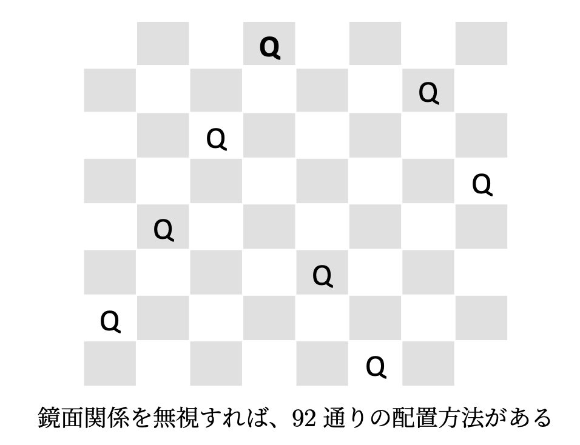

# ８クイーン

ハノイの塔では，再帰構造を活かして，エレガントな解法を得ることができました。しかし，ハノイの塔のようにエレガントに解ける問題ばかりではありません。

今回は，正解を得るため，「試行錯誤（**バックトラック法**）」を繰り返しながら解く方法を学びましょう。

## 前期の課題

チェスのクイーンは，上下左右斜めの8方向，将棋の飛車と角行を合わせた動きをする。
8個のクイーンをチェス盤(8×8)上においたとき，
どのクイーンも他のクイーンから取られないように配置する方法をすべて表示せよ。



```
解 92
⬜🟫⬜🟫⬜🟫⬜👑
🟫⬜🟫👑🟫⬜🟫⬜
👑🟫⬜🟫⬜🟫⬜🟫
🟫⬜👑⬜🟫⬜🟫⬜
⬜🟫⬜🟫⬜👑⬜🟫
🟫👑🟫⬜🟫⬜🟫⬜
⬜🟫⬜🟫⬜🟫👑🟫
🟫⬜🟫⬜👑⬜🟫⬜
```

### 解説

8クイーンは、**バックトラックアルゴリズム**の代表的な練習課題です。
鏡面関係を無視すれば、92通りの配置方法があることが知られています。

プログラムは，愚直に書いていきましょう。

1. チェス盤は、２次元配列を使って表現しましょう。
2. 上から順番に配置できるところにクイーンを配置しておきます。
3. 配置できなくなったら，既に配置したクイーンを戻し、次の位置を試します。


配置したクイーンを戻し、次の位置を試すような試行錯誤を**バックトラック法**(backtracking)といいます。

ただし，バックトラック法を用いるにしても，あまりにナイーブに配置を試していくと
組み合わせ(${}_{n^2} C_n$通り)があるので，時間がかかり過ぎます。

そこでひとつクイーンを配置したら，置けなくなった斜め縦横方向のマスを配置不可(\C{DISABLED})にします。
ポイントは，バックトラックしたとき，配置可(\C{ENABLED})に戻せるように作ることです。


### 盤のデータ構造

```py
N = 8
盤 = [[0] * N for _ in range(N)] # NxNの2次元配列
```

```py
def クイーンが置けるとき(盤, x, y):
    return 盤[x][y] == 0
```

```py
状態 = ['⬜', '💋', '💣']

def 表示する(盤):
    for y in range(N):
        for x in range(N):
            print(状態[盤[x][y]], end='')
        print()
    print()

```

### マスクする

```py
空 = 0
クイーン = 1
マスク = 2  # クイーンが置けない位置

def マスクする(盤, x, y):
    assert 盤[x][y] == 0
    # 同じ行は全てマスクする
    for xx in range(0, N):
        盤[xx][y] = マスク
    # 同じ列は全てマスクする
    for yy in range(y+1, N):
        盤[x][yy] = マスク
    # 斜めもマスクする
    dx = 1
    for yy in range(y+1, N):
        if x-dx>=0:
            盤[x-dx][yy] = マスク
        if x+dx <N:
            盤[x+dx][yy] = マスク
        dx += 1
```


```py
for y in range(0, N): # 0行目から
    for x in range(0, N):
        if クイーンが置けるとき(盤,x,y):
            マスクする(盤,x,y)
            盤[x][y] = 1
    表示する(盤)
```


y行目でクイーンがおける場所を探す

```py
def 置ける場所を探す(盤, y):
    if y == N: # 最後の行に達した
        盤を表示する(盤)  #正解として
        return
    for x in range(0, N):
        if 盤[x][y] == 0: 
            盤のコピー = 盤[:]
            mask(盤のコピー, x, y)
            盤のコピー[x][y] = 1
            置ける場所を探す(盤のコピー, y+1)
```

あとは，1行ずつ解き進める関数を作り，行数が$n$に達したら，
$n$個のクイーンを配置できたことになります。


## オブジェクト指向版

Nクイーン問題の解法例を表示するプログラムを
オブジェクト指向プログラミングで書き直してみましょう。

<div class="alert alert-info">

Let's try: コード例を見る前に自力で頑張ろう

* クラス名 `NQueen`
* クイーンの数は、NQueen(N=10)のようにパラメータで増やせるようにする
* 見つかった解をカウントする

</div>

### コード例

オブジェクト指向で書き直したコード例です。

__主な変更点__

* 変数名を英語化
* Nクイーン (Nの大きさをパラメータ化)
* 盤のデータ構造を1次元配列
* 明示的なバックトラックする


```py

EMPTY = 0
QUEEN = 1
MASK = 2

class NQueen(object):
    N:int
    board: list
    solved: int # 見つかった解の数

    def __init__(self, N=8):
        self.N = N 
        self.board = [EMPTY] * N*N  # 1次元配列
        self.solved = 0
    
    def p(self, x, y):
        return x + self.N * y

    def show(self, x):
        print('解', self.solved)
        for y in range(self.N):
            for x in range(self.N):
                print('💋' if self.board[self.p(x,y)] == 1 else '✨', end='')
            print()
        print()

    def mask(self, x, y):
        assert self.board[self.p(x,y)] == EMPTY
        # 同じ行は全てマスクする
        for xx in range(0, self.N):
            self.board[self.p(xx,y)] = MASK
        # 縦, 斜めもマスクする
        for dx, yy in enumerate(range(y+1, self.N), start=1):
            self.board[self.p(x,yy)] = MASK
            if x-dx>=0:
                self.board[self.p(x-dx,yy)] = MASK
            if x+dx <N:
                self.board[self.p(x+dx,yy)] = MASK

    def solve(self, y=0):
        if y == self.N: # 最後の行に達した
            self.solved += 1
            self.show()
            return
        for x in range(0, self.N):
            if self.board[self.p(x,y)] == EMPTY: 
                saved = self.board[:] # コピーを保存する
                self.mask(x,y)
                self.board[self.p(x,y)] = QUEEN
                self.solve(y+1)
                self.board = saved # コピーした状態に戻す

game = NQueen()
game.solve()
```

### 計算量

バックトラック法は，一般に，$N$が大きくなると，
時間計算量は指数的に大きくなります。
したがって，シンプルだけど，あまり効率のよい方法とは言えません。

```
6クイーン 解 4
✨✨✨✨💋✨
✨✨💋✨✨✨
💋✨✨✨✨✨
✨✨✨✨✨💋
✨✨✨💋✨✨
✨💋✨✨✨✨
```

```
8クイーン: 解 92
✨✨✨✨✨✨✨💋
✨✨✨💋✨✨✨✨
💋✨✨✨✨✨✨✨
✨✨💋✨✨✨✨✨
✨✨✨✨✨💋✨✨
✨💋✨✨✨✨✨✨
✨✨✨✨✨✨💋✨
✨✨✨✨💋✨✨✨
```

```
9クイーン: 解 352
⬜🟫⬜🟫⬜🟫⬜🟫👑
🟫⬜🟫⬜🟫⬜👑⬜🟫
⬜🟫⬜👑⬜🟫⬜🟫⬜
🟫👑🟫⬜🟫⬜🟫⬜🟫
⬜🟫⬜🟫⬜🟫⬜👑⬜
🟫⬜🟫⬜🟫👑🟫⬜🟫
👑🟫⬜🟫⬜🟫⬜🟫⬜
🟫⬜👑⬜🟫⬜🟫⬜🟫
⬜🟫⬜🟫👑🟫⬜🟫⬜
```

```

10クイーン: 解 724
✨✨✨✨✨✨✨✨✨💋
✨✨✨✨✨✨✨💋✨✨
✨✨✨✨💋✨✨✨✨✨
✨✨💋✨✨✨✨✨✨✨
💋✨✨✨✨✨✨✨✨✨
✨✨✨✨✨💋✨✨✨✨
✨💋✨✨✨✨✨✨✨✨
✨✨✨✨✨✨✨✨💋✨
✨✨✨✨✨✨💋✨✨✨
✨✨✨💋✨✨✨✨✨✨
```

<div class="alert alert-info">

Let's try

Nを大きくしていき、いくつまで解が求められるか調べてみよう。

</div>

注意：ボードの状態を表示する関数\C{draw}は，自分で書いて試してください。

さて，このプログラムで$N$クイーンの$N$を大きくしながら，
パズルを解く時間を測定してみました。
すると，$14$クイーン辺りで，秒オーダーを超えました。

10 Queen Solution: 724 19.100000ms
11 Queen Solution: 2680 64.600000ms
12 Queen Solution: 14200 317.400000ms
13 Queen Solution: 73712 1730.300000ms
14 Queen Solution: 365596 12223.300000ms

### コースワーク

